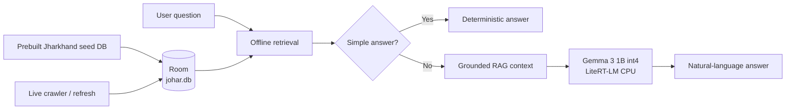

# Johar AI

Johar AI is an offline-first Android assistant focused on Jharkhand. The product goal is a small, trusted local AI: ask about places, food, festivals, culture, emergency information, weather context, and local bazar/haat knowledge using a local knowledge base first and an on-device LLM only when natural-language synthesis is useful.

## Current architecture



The LLM never replaces retrieval. Retrieval selects evidence first; generation receives that grounded context.

## Android modules

- `:app` — Compose UI, app composition, developer harness, ViewModel lifecycle.
- `:johar-domain` — pure Kotlin domain contracts and use cases.
- `:johar-data` — Room, prebuilt knowledge DB, retrieval, crawler, refresh, RAG context building, model storage, and LiteRT-LM runtime.

## Local knowledge

Johar starts from a prebuilt Room-compatible SQLite database:

`app/src/main/assets/johar-base-2026.09.db`

Room copies this seed on first database creation. The working database then lives as `johar.db` and can be enriched/refreshed by the crawler. Stable knowledge belongs in the seed; volatile information should be refreshed separately.

Core persisted concepts are:

- knowledge entities
- source-backed facts
- entity relationships
- media metadata/references
- crawl keywords
- source snapshots

## Answer pipeline

```text
Question
  -> OfflineKnowledgeRetriever
  -> evidence hits
  -> deterministic answer when sufficient
  -> otherwise OfflineRagContextBuilder
  -> LiteRtLmAnswerSynthesizer
  -> grounded Gemma answer
```

Current retrieval evaluation is frozen at:

- Recall@1: 88%
- Recall@3: 100%
- Failures@3: 0 / 100

The expected-answer set is not changed just to improve the score.

## On-device LLM

Current runtime:

- Model: Gemma 3 1B Instruct, int4 LiteRT artifact
- File: `gemma3-1b-it-int4.litertlm`
- Model size used in development: `584,417,280` bytes
- Runtime: LiteRT-LM `0.17.0`
- Backend: CPU
- Context limit configured by Johar: 2,048 tokens
- Output cap: 512 tokens
- One `Engine` is retained for the owning ViewModel lifecycle
- A fresh `Conversation` is created and closed per generation
- Generation timeout: 90 seconds
- Model file is kept outside APK/assets and Git

### Verified development result

Real native Gemma generation is verified on the ARM64 Android emulator (`sdk_gphone16k_arm64`, `ranchu`) using the CPU backend.

Observed run:

- engine initialization: ~2.3 s
- first generation: ~1.0 s
- first request total: ~3.3 s
- second request with reused engine: ~1.0 s total
- second request did not reinitialize the engine

Example query:

`Rugra Jharkhand me special kyun hai?`

The model produced a grounded answer from retrieved Jharkhand evidence. Physical-phone performance is still unverified and must not be inferred from emulator results.

## Knowledge refresh

Johar combines two paths:

1. **Baseline knowledge** — generated outside the app and shipped as the prebuilt SQLite seed.
2. **Live enrichment** — bounded crawler/WorkManager refresh for stale, changing, or newly discovered knowledge.

Sources currently supported by the data layer include Wikidata, focused OpenStreetMap/Overpass discovery, Wikipedia, Wikivoyage, Wikimedia Commons, and Open-Meteo.

## Design principles

- Offline first.
- Evidence before generation.
- Deterministic answers for simple facts.
- LLM only when synthesis improves the answer.
- Preserve provenance and freshness.
- No unsupported live inventory/current-status claims from static data.
- Model/runtime must remain replaceable.
- Do not bundle large LLM payloads in the APK.

## Documentation

- [Android system design](docs/android-system-design.md)
- [Model and answer test cases](docs/model-answer-test-cases.md)
- [LiteRT-LM runtime testing](docs/litert-lm-device-testing.md)

## Project

- App: Johar AI
- Package: `com.akeshridev.johar`
- Platform: Android
- Language: Kotlin
- UI: Jetpack Compose
