# Johar AI — Android System Design

This document describes the current Android architecture of Johar AI as implemented in the repository. It covers storage, retrieval, deterministic answers, grounded RAG, on-device LLM execution, crawler/refresh, lifecycle, threading, failure boundaries, and the developer test harness.

## 1. Product boundary

Johar AI is an offline-first Jharkhand assistant. The system should answer from trusted local evidence whenever possible and use an on-device LLM only as a synthesis layer.

The core rule is:

> **Evidence first, generation second.**

The LLM is not the knowledge source. The local knowledge system is the source; Gemma converts selected evidence into natural language.

## 2. High-level architecture

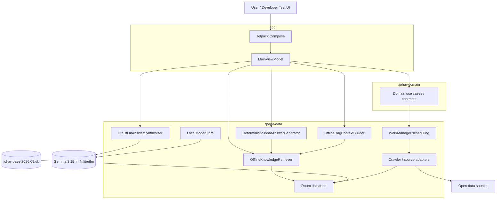

## 3. Module responsibilities

### `:app`

Owns:

- Jetpack Compose UI
- application composition
- ViewModel lifecycle
- developer buttons / test harness
- logging entry points for retrieval, deterministic answers, evaluation, crawling, and native LLM generation

Does not own:

- Room schema
- retrieval implementation
- source adapters
- model runtime internals

Current developer flow starts from `MainViewModel`.

### `:johar-domain`

Pure Kotlin boundary for domain contracts and use cases.

Key rule: no Android, network, database, or UI implementation types should leak into this module.

### `:johar-data`

Owns the implementation-heavy parts:

- prebuilt Room database
- DAOs and persistence
- offline retrieval
- RAG context creation
- deterministic answer generation
- local model storage/validation
- LiteRT-LM native inference
- crawler/source discovery
- refresh orchestration
- WorkManager implementation

## 4. Local knowledge storage

Johar ships a Room-compatible SQLite seed:

```text
app/src/main/assets/johar-base-2026.09.db
```

At first database creation:

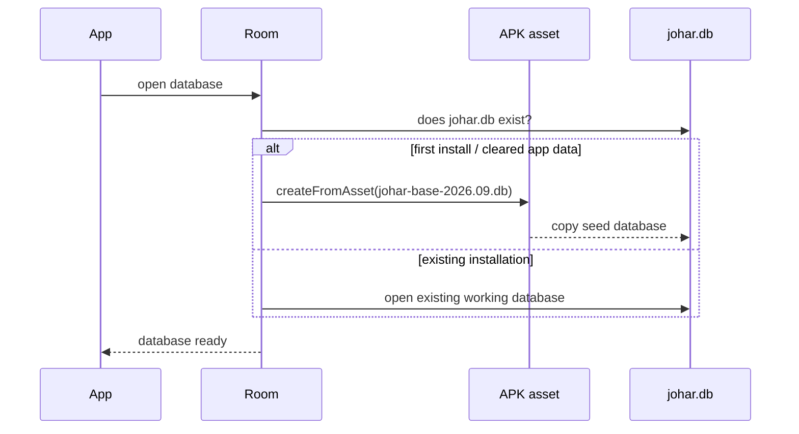

The seed is copied only when the database does not yet exist. Later bundled seed changes do not automatically overwrite the user's working database.

Current Room database name:

```text
johar.db
```

Core tables include:

- `knowledge_entities`
- `source_facts`
- `entity_relationships`
- `media_assets`
- `crawl_keywords`
- `crawled_sources`

Conceptually, the data model is:

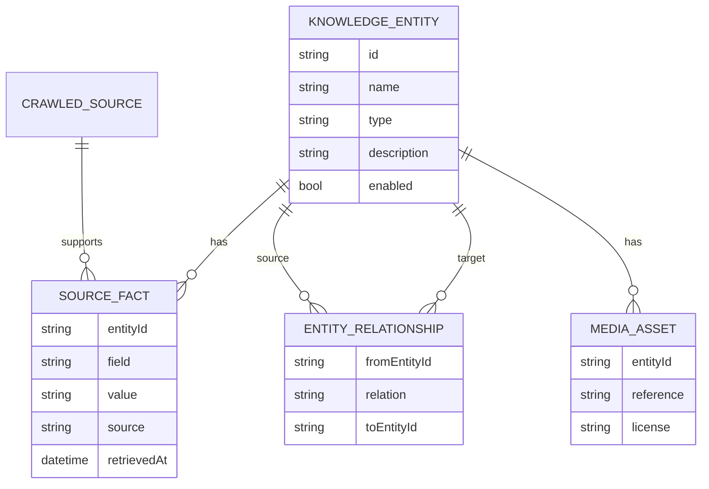

The database stores knowledge and references, not arbitrary media binaries by default.

## 5. Knowledge types

The domain supports broad entity types including places, attractions, natural features, food, festivals, cultural practices, markets, shops, restaurants, hospitals, police stations, emergency services, villages, towns, cities, districts, regions, rivers, airports, railway stations, bus stands, facilities, organizations, and other entities.

A discovery category is not automatically an entity type. Example: a FOOD search result must still have evidence before it is persisted as FOOD.

## 6. Retrieval path

`OfflineKnowledgeRetriever` reads the working Room database only.

Current retrieval is intentionally inspectable and lightweight. It considers signals such as:

- normalized query terms
- entity names
- aliases
- descriptions
- source-backed facts
- broad type hints
- pack/type metadata where relevant

The retrieval contract returns ranked evidence hits, not final generated prose.

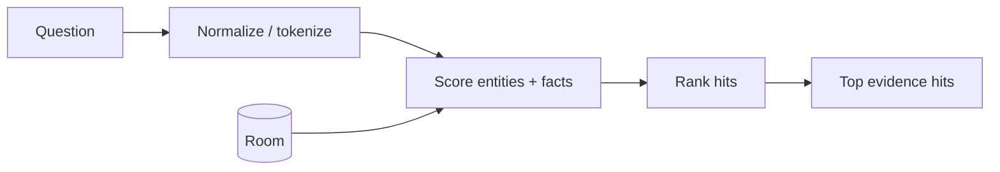

Current frozen retrieval evaluation:

```text
100 queries
Recall@1 = 88%
Recall@3 = 100%
Failures@3 = 0
```

The expected result set must not be modified simply to inflate the metric.

## 7. Answer routing

Johar has two answer paths.

### Path A — deterministic answer

For a simple fact or known structured response, Johar can answer without invoking the LLM.

Examples:

- state animal
- simple food definition
- list of temples
- nearby waterfalls when retrieval is sufficient
- no-answer when the knowledge pack has no evidence

### Path B — grounded LLM synthesis

When natural phrasing or explanation is useful:

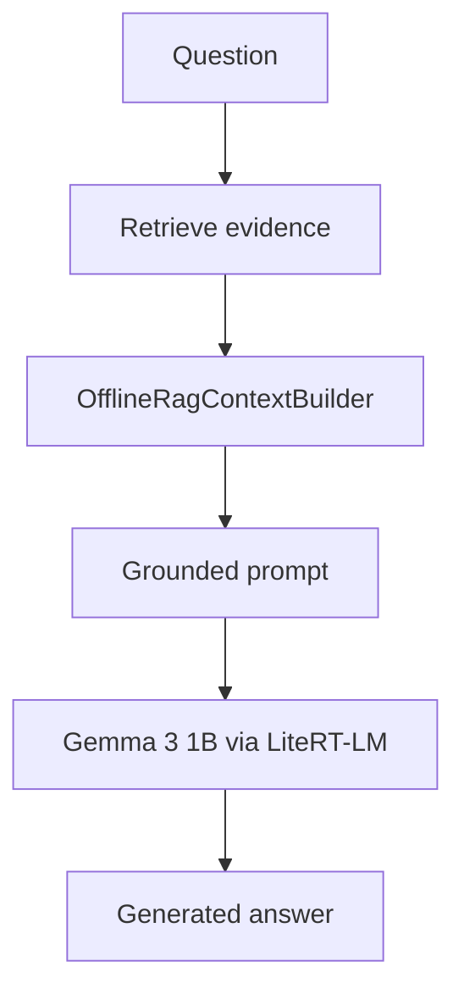

The LLM receives the evidence context produced by Johar; it does not independently search the internet.

## 8. RAG context boundary

`OfflineRagContextBuilder` is the boundary between retrieval and generation.

It packages:

- the user's question
- selected evidence hits
- relevant facts/descriptions
- instructions that constrain the model to the supplied evidence

This boundary is deliberately replaceable. Retrieval can improve later without changing the LLM runtime, and the model runtime can change without rewriting retrieval.

## 9. On-device model runtime

Current model/runtime configuration:

| Item | Current value |
|---|---|
| Model | Gemma 3 1B Instruct int4 |
| Artifact | `gemma3-1b-it-int4.litertlm` |
| Development artifact size | `584,417,280` bytes |
| Runtime | LiteRT-LM `0.17.0` |
| Backend | CPU |
| Max context tokens | 2,048 |
| Max output tokens | 512 |
| Sampler | topK 20, topP 0.9, temperature 0.5, seed 0 |
| Repetition penalty | 1.3 |
| No-repeat n-gram | 3 |
| Timeout | 90 seconds |

The model is stored in app-private storage:

```text
/data/user/0/com.akeshridev.johar/files/models/gemma3-1b-it-int4.litertlm
```

The large model payload is intentionally not committed to Git and is not bundled in the APK.

## 10. Model delivery and validation

`LocalModelStore` owns the filesystem location and delivery boundary.

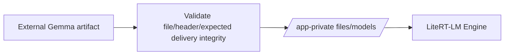

For development, the model can be provisioned with ADB.

Example:

```bash
adb push /absolute/path/gemma3-1b-it-int4.litertlm /data/local/tmp/
adb shell run-as com.akeshridev.johar mkdir -p files/models
adb shell run-as com.akeshridev.johar cp /data/local/tmp/gemma3-1b-it-int4.litertlm files/models/
```

File presence alone is not sufficient proof of artifact integrity. Size/checksum should be verified during provisioning.

## 11. Engine lifecycle

`LiteRtLmAnswerSynthesizer` owns one native `Engine` for its lifecycle.

The owning `MainViewModel` creates one synthesizer and calls `close()` from `onCleared()`.

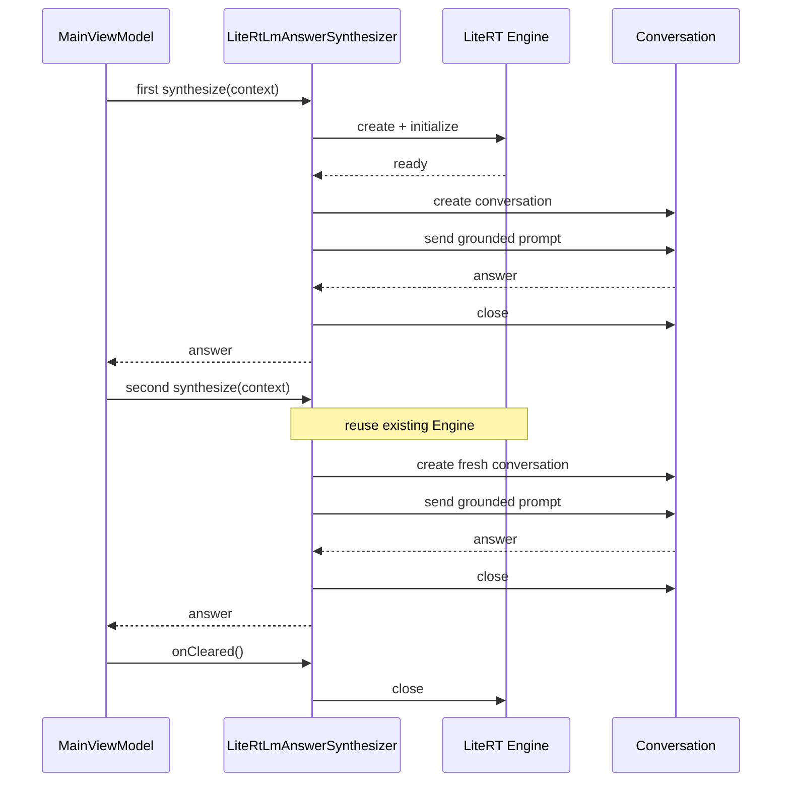

This avoids paying model initialization cost for every question while also preventing conversation state from leaking between independent requests.

## 12. Native inference worker and threading

Native inference is serialized through `NativeInferenceWorker` on a dedicated background execution path.

Goals:

- keep JNI/model work off the main thread
- serialize engine operations
- avoid concurrent use of the same native engine
- order cleanup behind in-flight work
- reject unsafe reuse after timeout/uncertain cleanup

The caller has a 90-second timeout. Important limitation: coroutine cancellation can release the caller, but it cannot forcibly kill a JNI call that is blocked inside native code.

## 13. Verified emulator execution

Johar has successfully executed real Gemma inference on an ARM64 Android emulator.

Observed device information:

```text
model=sdk_gphone16k_arm64
hardware=ranchu
abis=arm64-v8a
```

Observed first request:

```text
ENGINE_INITIALIZE_COMPLETE latencyMs=2289
GENERATION_COMPLETE latencyMs=988
SUCCESS latencyMs=3287
```

Observed second request:

```text
CONVERSATION_CREATE_START
GENERATION_START
GENERATION_COMPLETE latencyMs=1024
SUCCESS latencyMs=1027
```

There was no second engine initialization, confirming engine reuse.

Physical-device runtime/performance remains separately unverified.

## 14. Failure boundaries

Johar separates major failure classes so debugging is easier.

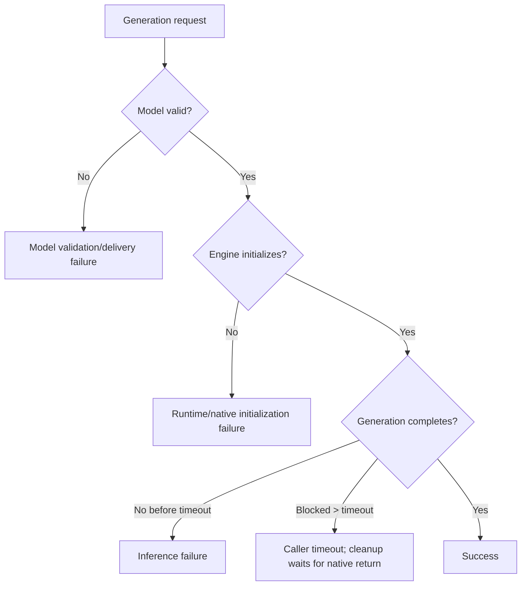

Important diagnostic distinction:

- corrupt/truncated model
- unsupported or broken native runtime
- backend initialization failure
- generation failure
- timeout/blocking JNI
- poor answer quality

These are different problems and should not be treated as one generic “LLM failed” state.

## 15. Crawler and live refresh

The crawler is a knowledge builder/enrichment system, not the primary baseline source for production startup.

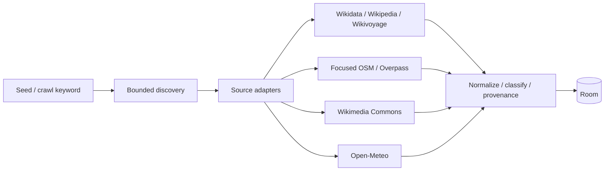

Rules:

- source failures are isolated
- preserve provenance
- conflicting source-backed facts may coexist
- refresh replaces source-scoped data instead of unbounded append
- do not use broad public Overpass scans
- do not use public Nominatim as a bulk crawler
- static market/shop discovery is not proof of live stock

## 16. WorkManager refresh

Background refresh uses WorkManager with network and battery constraints.

Manual enqueue can trigger immediate work and ensures a periodic statewide refresh exists.

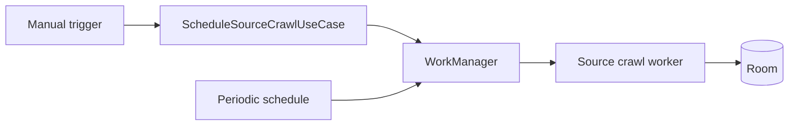

## 17. Developer harness

The current app includes development buttons/logging for:

- offline RAG retrieval
- deterministic answers
- retrieval evaluation
- live crawl
- on-device LLM

Important Logcat tags:

```text
JoharDB
JoharRAG
JoharAnswer
JoharEval
JoharLLM
```

These are developer validation surfaces, not the final consumer chat UI.

## 18. Current end-to-end request design

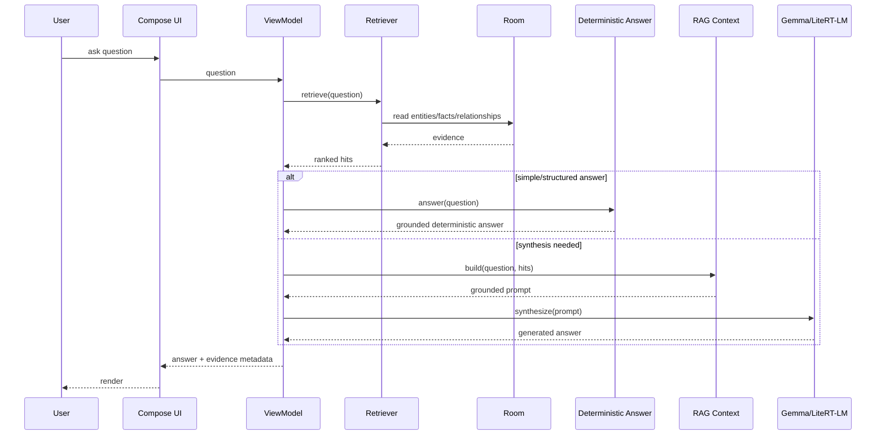

## 19. Design invariants

The following should remain true as Johar evolves:

1. Retrieval and evidence remain independent from the chosen LLM.
2. The model is not trusted as the factual source of record.
3. Empty/no-evidence queries must not be turned into confident hallucinations.
4. Simple facts should not pay an unnecessary LLM cost.
5. The model engine should be reused while the owner is alive.
6. Conversations should be isolated unless intentional chat memory is introduced.
7. Large models stay outside the APK and Git.
8. Static knowledge and volatile/live data use different freshness strategies.
9. Provenance should survive ingestion, retrieval, and presentation.
10. Evaluation datasets should remain stable enough to expose regressions rather than being edited to improve metrics.

## 20. Near-term architecture evolution

Likely next improvements, while preserving the boundaries above:

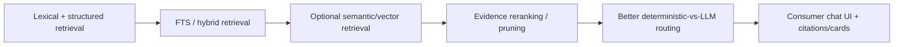

The goal is not to make every query use more AI. The goal is to make the smallest necessary component smarter while keeping answers grounded, fast, inspectable, and offline-capable.
